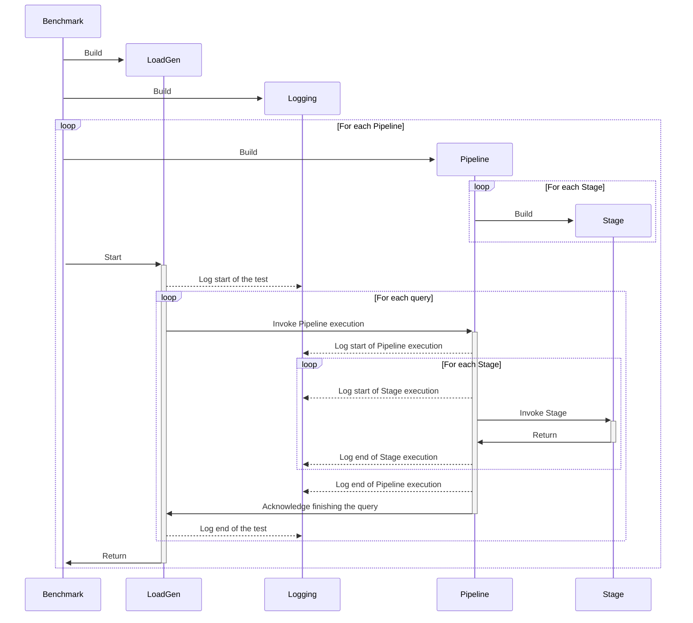

# Colocation Benchmark

The Colocation Benchmark is a modular and flexible framework designed to evaluate the end-to-end performance of (colocated) machine learning pipelines. The benchmark is built on the following core principles:

- **End-to-End Performance**: Quantifying performance across the entire pipeline, including data loading and preprocessing.
- **Modularity**: Stages like data loading and model execution are standalone building blocks, allowing for flexible pipeline construction.
- **Colocation**: Facilitating research into colocation schedulers and resource managers by providing scenarios with detailed time breakdowns for colocated workloads.

## Getting Started

### Installation

1.  Clone the repository:
    ```bash
    git clone https://github.com/your-repo/collocation-benchmark.git
    cd collocation-benchmark
    ```

2.  Install dependencies:
    ```bash
    conda env create -f environment.yml
    ```

### Usage

To run the benchmark, use the `main.py` script with a configuration file:

```bash
python main.py <path_to_config.yml>
```

Example:
```bash
python main.py pipeline_configs/finetune_huggingface.yml
```

## Architecture

The benchmark consists of several modular components that work together to execute and measure ML pipelines.



### Components

- **Benchmark** (`main.py`): The entry point. It parses the configuration, initializes the global logger, and spawns processes for each pipeline's LoadGen.
- **LoadGen** (`loadgen/`): Generates queries and submits them to the pipeline based on a scheduler (e.g., offline, poisson). It is agnostic to the specific workload.
- **Pipeline** (`pipeline/`): Orchestrates a sequence of Stages. It manages communication between stages and logs execution times.
- **Stage** (`stages/`): The fundamental building block. A stage performs a specific task (e.g., DataLoader, Inference, Finetuning).
- **Logging** (`utils/logger.py`): Asynchronously records performance metrics to minimize interference with execution.

## Configuration

The benchmark is configured via YAML files. A configuration defines the pipelines, their stages, and the load generation policy.

### Structure

See `pipeline_configs/` for examples. A typical config includes:

```yaml
name: "benchmark_run_name"
pipelines:
  - name: "Pipeline Name"
    inputs: [0] # IDs of input stages
    outputs: [1] # IDs of output stages
    dataset_stage_id: 0
    loadgen:
      component: loadgen.OfflineLoadScheduler
      queue_depth: 10
      max_queries: 100
      config:
        rate: 5 # requests/sec
    stages:
      - name: "Stage 1 (e.g., DataLoader)"
        id: 0
        outputs: [1]
        component: stages.package.ClassName
        config:
            # Stage-specific configuration
            batch_size: 8
            ...
      - name: "Stage 2 (e.g., Model)"
        id: 1
        component: stages.package.ClassName
        config:
            model_name: "..."
            ...
```

## Supported Stages

The benchmark currently supports the following families of stages:

- **LLM HuggingFace** (`stages/llm_huggingface`):
    - `HuggingFaceDataLoader`: Loads text datasets.
    - `Finetune`: Instruction tuning using PEFT/LoRA.
    - `Inference`: Text generation.
- **LLM Torchtune** (`stages/llm_torchtune`):
    - Implementation of finetuning and generation using PyTorch Tune.
- **Self RAG** (`stages/self_rag`):
    - Retrieval-Augmented Generation workflows.
- **Vision** (`stages/torchvision_classification`):
    - Standard computer vision classification tasks.

## Extensibility

### Adding a New Stage

1.  Create a new directory in `stages/`.
2.  Inherit from the base `Stage` class (`stages/stage.py`).
3.  Implement the `run` method and initialization logic.
4.  Register your component path in the YAML config (e.g., `stages.my_new_stage.MyStage`).

### Adding a Scheduler

1.  Add a new scheduler class in `loadgen/schedulers/`.
2.  Inherit from the base `LoadScheduler`.
3.  Implement the generation logic.
