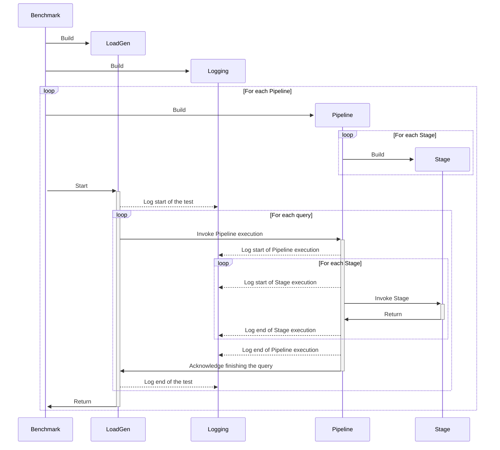

# Colocation Benchmark

## Benchmark execution

### Benchmark's building blocks and their responsibility

#### Benchmark

Benchmark is the entry point to our benchmark. It parses configuration files, which define the pipelines as well as general settings for other building blocks of the benchmark such as the LoadGen. Based on the configuration files, initiate three other building blocks: LoadGen, Pipeline/s and Logging.

#### LoadGen

This is the building block that issues queries to the SUT based on different policies. To make this block reusable, the LoadGen is not aware of the specific type of pipelines or datasets, but rather uses sampleIDs as an abstraction to pass to data loaders, which are the first stages of the pipelines.

##### Logging

It logs the end-to-end performance statistics of the pipeline execution, such as the run time splits of the dfferent stages of the pipeline. The logging is performed in a separate thread asynchronously in order to not interfere with the pipeline's execution.

#### Pipeline

The pipeline holds the different stages and orchestrates the communication between them, as well as, the logging of execution times of the separate stages.

#### Stage

This is the building block of the pipelines. A stage can perform tasks such as data loading, data preprocessing or model execution. The stages are separated in order to make the development of specific part of a pipeline and subsequent evaluation as easy as possible.
