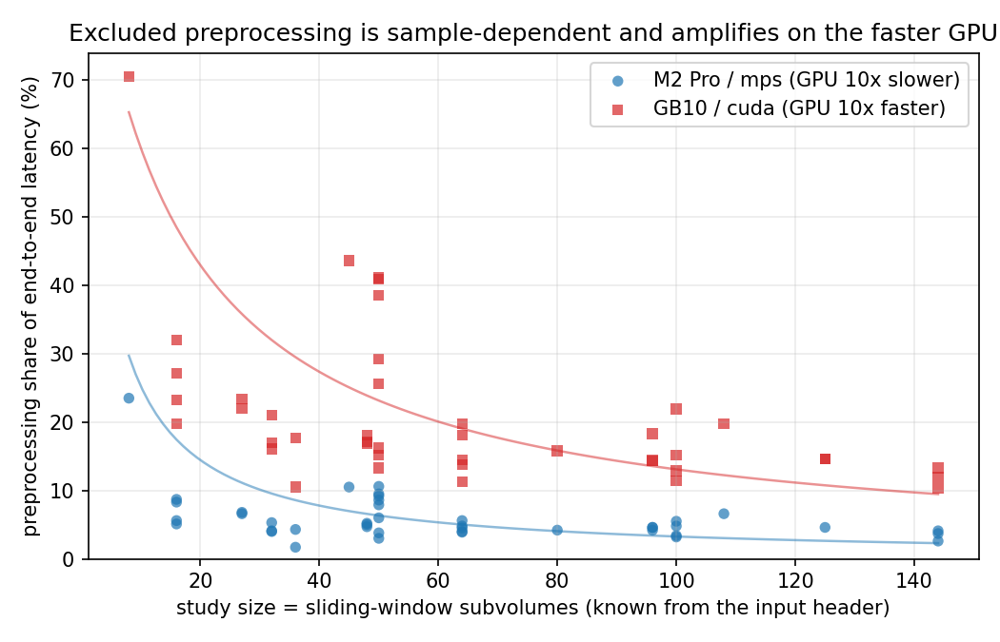

# Finding A — MLPerf's excluded preprocessing is sample-dependent and amplifies on faster accelerators

*3D-UNet / KiTS19 medical segmentation (MLPerf Inference workload), 42 studies, R=1, on
M2 Pro (mps) and GB10 (cuda). Data: `results_{mps,cuda}_r1.csv`; figure + numbers:
`analyze_preprocessing.py --fig`.*

## Claim

MLPerf Inference times **only the model** and preprocesses **offline** (untimed). For the
3D-UNet pipeline (load NIfTI → resample/normalize/pad → sliding-window inference) that
excluded preprocessing is not a fixed, ignorable tax. It is:

1. **Sample-dependent** — its share of end-to-end latency varies with the input, from a few
   percent for large studies to a majority for small ones; and
2. **Larger on the faster accelerator** — the same excluded stage is a ~4× bigger share of
   end-to-end on GB10 than on the M2 Pro, because the GPU is ~10× faster while the CPU-bound
   preprocessing is only ~2× faster (Amdahl).

The workload is a deliberately **simple linear pipeline**, so this is a property of MLPerf's
*measurement boundary*, not of pipeline complexity. The two harnesses agree on accuracy
(Dice mean 0.862, matching the reference model card), so the comparison is honest, not a
strawman.

## Evidence

**(1) Sample-dependent.** Per-study preprocessing fraction spans a wide range and falls with
study size (subvolume count, an 8–144 spread that is known from the input header before
inference):

| device | preprocess mean | inference mean | pre-fraction (median) | pre-fraction (range) | corr(fraction, size) |
|---|--:|--:|--:|--:|--:|
| M2 Pro (mps) | 4.32 s | 80.4 s | 4.8 % | 1.7 – 23.5 % | −0.41 |
| GB10 (cuda) | 1.88 s | 8.0 s | 17.1 % | **10.3 – 70.5 %** | −0.47 |

The mechanism: inference time scales with the study (more subvolumes → more forward passes)
while preprocessing is comparatively flat, so **small studies are preprocessing-dominated** —
e.g. `case_00160` (8 subvolumes) is **70 % preprocessing on GB10** (24 % on the Mac). A single
MLPerf-style "inference-only" number silently discards a stage whose weight depends on which
scan you feed it.

**(2) Amplifies on the faster GPU (cross-device, 42 shared studies).**

| stage | M2 Pro | GB10 | speedup |
|---|--:|--:|--:|
| inference (GPU) | 80.4 s | 7.8 s | **10.2×** |
| preprocess (CPU) | 4.32 s | 1.86 s | **2.3×** |
| → preprocessing share | **5.1 %** | **19.2 %** | ~3.8× amplification |

The GPU accelerates ~10× but the CPU-bound preprocessing only ~2×, so by Amdahl the excluded
stage's relative share **quadruples** on the faster machine (the accelerator outpaces the
CPU stage ~4.4×). MLPerf's inference-only number therefore captures only **~81 %** of real
end-to-end on GB10 vs **~95 %** on the Mac — **and the blind spot grows as accelerators get
faster while data preparation does not.**

*(Precision note: the two CPUs are not identical — GB10's is ~2.3× faster at preprocessing,
consistent with more cores / memory bandwidth. The load-bearing fact is the **mismatch** in
speedups, 10× vs 2×, not equal CPUs. Stating it as "GPU speedup far outpaces preprocessing
speedup" is the airtight framing.)*

*Both series fall with study size (sample-dependence); the GB10 series sits ~4× higher at
every size (accelerator amplification). Curves are the mechanistic model
`frac = P / (P + S·n)` (P = mean preprocess, S = per-subvolume inference).*

## Why it matters / honest scope

This is a **single-request / serial-latency** phenomenon. For pure *throughput*, a pipelined
server overlaps one request's preprocessing with another's inference and hides it (we measure
serial makespan 424 s → pipelined 330 s on GB10, ~22 % hidden) — which is exactly the regime
MLPerf's offline-preprocessing model assumes. But in **latency-sensitive online serving**, a
request's raw scan arrives *with the request*: there is nothing to prefetch, and the overlap
that hides preprocessing needs a *different* concurrent request to overlap against. To
minimize one request's latency you must preprocess it online and serially, so the excluded
resample/normalize/pad sits fully on the critical path — the 19 % (up to 70 %) above — and, by
Amdahl, that fraction *grows* as inference accelerates. GPU-side preprocessing (e.g. DALI)
speeds the stage but does not remove it from the single-request path.

**Takeaway.** MLPerf's model-only, offline-preprocessed measurement is faithful for *offline
batch throughput* but understates real *online per-request* latency by an input-dependent,
hardware-dependent margin — one that its measurement boundary, by construction, cannot show,
and that widens precisely as the accelerators MLPerf ranks get faster.
